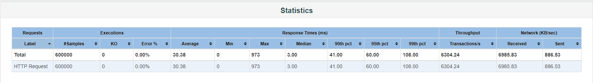
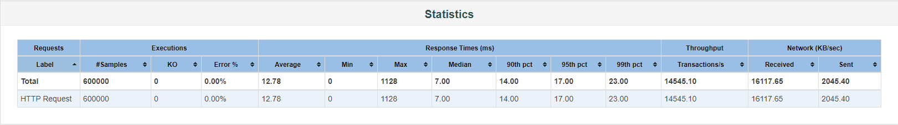
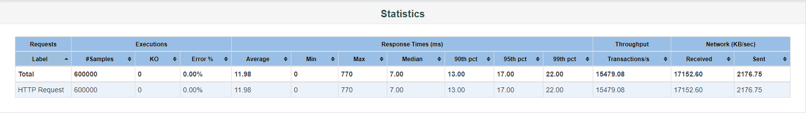

#Usage of JMeter Test in Terminal

```
./jmeter -n -t [Path of test_plan_of_MilkTeaMooc.jmx File] -l [Path to save the Result.jtl File] -e -o [Directory Path to save the Result Webpage]
```

#Load Test Example
***THE EXAMPLE ONLY TEST `/api/v1/pub/video/list_banner` INTERFACE***

- **Test Machine**  

| *CPU* | *Memory* | *Disk* |
| :-----: | :----: | :----: |
| Intel Xeon (Cascade Lake) Platinum 8269 <br /> 3.1 GHz/3.5 GHz | 16 GiB | Aliyun ESSD 40 GiB |

- **Test Result without using Cache**  



- **Test Result with Mybatis Second Level Cache**  



- **Test Result with Guava Cache**  

